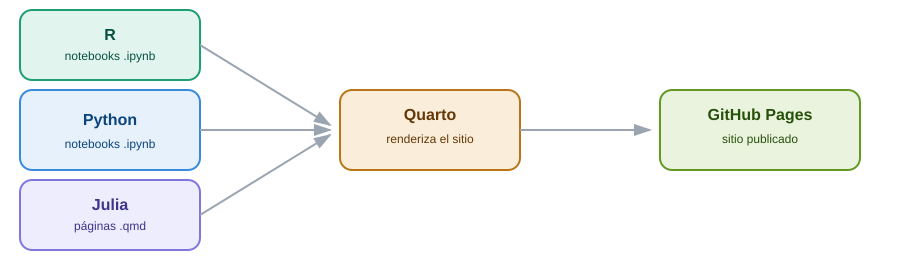

## Sobre el proyecto

Operación Jupyter es el proyecto de servicio social de la División de Ciencias Básicas, Facultad de Ingeniería, UNAM. Reúne tutoriales de introducción a tres lenguajes de programación de código libre — **R**, **Python** y **Julia** — pensados para quien empieza desde cero.

## Elige un lenguaje

::: {style="display:flex; gap:16px; flex-wrap:wrap; margin: 1.5rem 0;"}

::: {style="flex:1; min-width:220px; background:#E6F1FB; border-left:4px solid #378ADD; border-radius:10px; padding:18px;"}
### Python
Propósito general, ecosistema enorme, fácil de aprender.

[Empezar →](python/01-introduccion.ipynb)
:::

::: {style="flex:1; min-width:220px; background:#E1F5EE; border-left:4px solid #1D9E75; border-radius:10px; padding:18px;"}
### R
Estadística y gráficos, con RStudio como su entorno natural.

[Empezar →](r/01-introduccion.ipynb)
:::

::: {style="flex:1; min-width:220px; background:#EEEDFE; border-left:4px solid #7F77DD; border-radius:10px; padding:18px;"}
### Julia
Cómputo numérico de alto desempeño con sintaxis de alto nivel.

[Empezar →](julia/01-introduccion.qmd)
:::

:::

También puedes ir directo a los **[Tutoriales comparativos](tutoriales/index.qmd)** (ejercicios, quiz, ficha descargable) o revisar **[Mi progreso](progreso.qmd)**.

## Cómo se arma el sitio

### Cómo usar este sitio

Cada tutorial cubre, en el mismo orden para los tres lenguajes, para poder comparar directamente:

- Instalación e interfaces (RStudio, Google Colab, Jupyter)
- Tipos de datos y declaración de variables
- Estructuras de control (secuencias, decisiones, repeticiones)
- Estructuras de datos y objetos
- Funciones
- Particularidades del lenguaje
