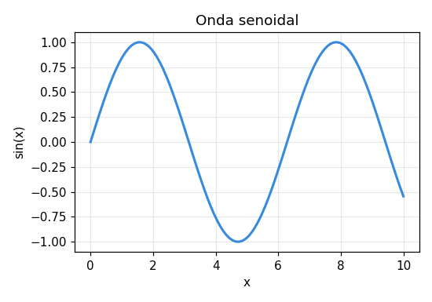
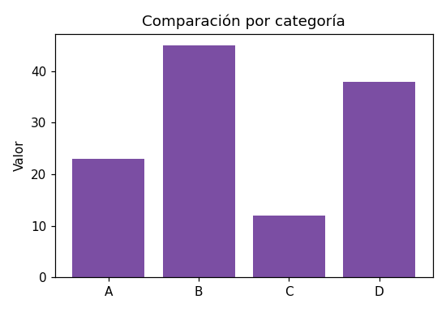

::: {.callout-important}
Código real, salidas ilustrativas generadas con otra herramienta (mismo resultado matemático) — Julia no corre en vivo en este sitio todavía.
:::

# Visualización

Los gráficos básicos: una línea (tendencia continua) y barras (comparar categorías).

## Gráfica de línea

```julia
using Plots

x = range(0, 10, length=100)
y = sin.(x)

plot(x, y, title="Onda senoidal", xlabel="x", ylabel="sin(x)", legend=false)
```



## Gráfica de barras

```julia
categorias = ["A", "B", "C", "D"]
valores = [23, 45, 12, 38]

bar(categorias, valores, title="Comparación por categoría", ylabel="Valor", legend=false)
```


