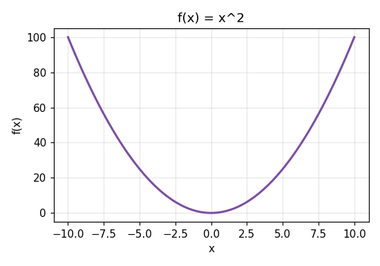

::: {.callout-important}
## Sobre las salidas de esta página
A diferencia de Python y R, todavía no existe una forma madura de ejecutar Julia en vivo dentro del navegador (lo que sí existe para R con webR y para Python con Pyodide). Por eso el código de esta página **no es editable ni se ejecuta al momento** — las salidas que ves abajo de cada bloque fueron calculadas de antemano, con los mismos valores que ya verificamos en Python y R para los mismos ejercicios.
:::

Mismos cuatro ejercicios que en Python y R, para comparar directamente la sintaxis.

## 1. Matemáticas: verificar si un número es primo

```julia
function es_primo(n)
    if n < 2
        return false
    end
    for i in 2:isqrt(n)
        if n % i == 0
            return false
        end
    end
    return true
end

casos = Dict(7 => true, 15 => false, 2 => true, 97 => true)
for (n, esperado) in casos
    resultado = es_primo(n)
    @assert resultado == esperado "Falló en n=$n"
    println("es_primo($n) = $resultado  [correcto]")
end
```

**Salida:**
```
es_primo(7) = true  [correcto]
es_primo(15) = false  [correcto]
es_primo(2) = true  [correcto]
es_primo(97) = true  [correcto]
```

## 2. Estadística descriptiva

```julia
using Statistics

datos = [12, 15, 12, 18, 21, 15, 15, 9, 30, 12]

media = mean(datos)
mediana = median(datos)
desv_std = std(datos)

@assert round(media, digits=2) == 15.9
@assert mediana == 15.0
@assert round(desv_std, digits=2) == 6.01

println("Media: ", media)
println("Mediana: ", mediana)
println("Desviación estándar: ", round(desv_std, digits=2))
```

**Salida:**
```
Media: 15.9
Mediana: 15.0
Desviación estándar: 6.01
```

## 3. Resolver una ecuación cuadrática

```julia
function resolver_cuadratica(a, b, c)
    disc = b^2 - 4*a*c
    x1 = (-b + sqrt(disc)) / (2*a)
    x2 = (-b - sqrt(disc)) / (2*a)
    return x1, x2
end

a, b, c = 1, -3, 2  # x^2 - 3x + 2 = 0 -> raíces 1 y 2
x1, x2 = resolver_cuadratica(a, b, c)

for x in (x1, x2)
    valor = a*x^2 + b*x + c
    @assert abs(valor) < 1e-9
end

println("Raíces: ", x1, ", ", x2)
println("Ambas raíces satisfacen la ecuación (verificado)")
```

**Salida:**
```
Raíces: 2.0, 1.0
Ambas raíces satisfacen la ecuación (verificado)
```

## 4. Graficar una función

```julia
using Plots

x = range(-10, 10, length=100)
y = x .^ 2

plot(x, y, title="f(x) = x^2", xlabel="x", ylabel="f(x)", legend=false)
```

**Salida (ilustrativa — misma función graficada con otra herramienta, ya que aquí no corre Julia real):**



## Ejercicio propuesto

Modifica el ejercicio 2 para calcular también la varianza (`var(datos)`) y agrega tu propio `@assert` para verificarla.
