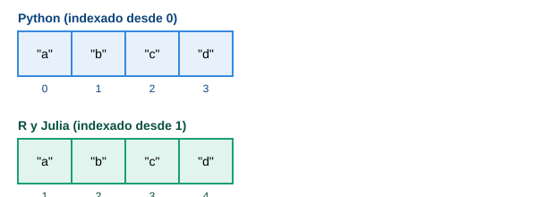

Ejercicios de matemáticas, estadística y gráficas, resueltos y verificados en los tres lenguajes, para comparar sintaxis y comportamiento lado a lado.

- [Quiz interactivo](quiz-comparativo.qmd) — preguntas con retroalimentación al instante (✓ / ✗)
- [Ejercicios en Python](ejercicios-python.ipynb)
- [Ejercicios en R](ejercicios-r.ipynb)
- [Ejercicios en Julia](ejercicios-julia.qmd)

## Un mismo dato, tres formas de contarlo

## Comparación de lenguajes

| Aspecto | Python | R | Julia |
|---|---|---|---|
| Indexado | Desde 0 | Desde 1 | Desde 1 |
| Bloques de código | Indentación obligatoria | Llaves `{ }` | `end` para cerrar bloques |
| Asignación | `=` | `<-` (convención) | `=` |
| Tipado | Dinámico | Dinámico | Dinámico, con despacho múltiple |
| Estructura de datos principal | Lista / `numpy.array` | Vector (nativo) | Array (nativo) |
| Manejo de datos tabulares | `pandas.DataFrame` | `data.frame` (nativo) | `DataFrames.jl` |
| Visualización | `matplotlib` | `plot()` / `ggplot2` | `Plots.jl` |
| Enfoque original | Propósito general | Estadística y gráficos | Cómputo numérico de alto desempeño |
| Ejecución | Interpretado | Interpretado | Compilado JIT (más rápido en cómputo pesado) |

## Ventajas y desventajas

::: {.callout-note}
## Python
- A favor: comunidad enorme, ecosistema muy amplio, fácil de aprender.
- En contra: más lento que Julia en cómputo numérico puro sin bibliotecas optimizadas.
:::

::: {.callout-tip}
## R
- A favor: diseñado para estadística — pruebas, modelos y gráficos con poco código.
- En contra: fuera de estadística y visualización es menos versátil que Python.
:::

::: {.callout-important}
## Julia
- A favor: desempeño cercano a lenguajes compilados con sintaxis de alto nivel.
- En contra: comunidad y ecosistema de paquetes más pequeños; primera ejecución de una función puede sentirse lenta (compilación JIT).
:::
